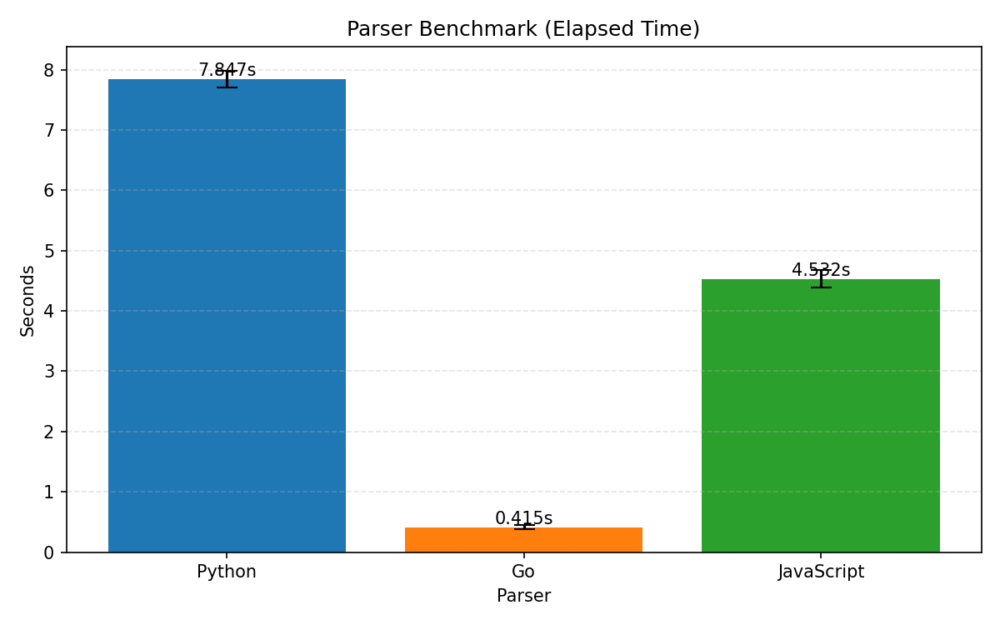

# Proyecto Multi-Lenguaje: Lexer/Parser de Interfaces

Este repositorio contiene el mismo lexer/parser de `Interfaces.g4` implementado en:

- Go (`lexer-go`)
- JavaScript (`lexer-js`)
- Python (`lexer-py`)

Tambien incluye scripts para:

- generar datos de prueba (`data/*.conf`)
- medir tiempos de ejecucion de los 3 parsers
- generar un grafico comparativo

## Requisitos Generales

- Java Runtime (requerido por ANTLR)
- ANTLR4 CLI disponible como `antlr4`
- Go 1.25+
- Node.js 18+
- Python 3.10+

## Estructura

- `Interfaces.g4`: gramatica compartida
- `lexer-go/`: implementacion Go
- `lexer-js/`: implementacion JavaScript
- `lexer-py/`: implementacion Python
- `data/`: archivos `.conf` para pruebas
- `generate_interfaces_data.py`: generador de archivos de prueba
- `benchmark_parsers.py`: benchmark en consola + JSON
- `plot_benchmark.py`: genera grafico desde JSON
- `run_benchmark_pipeline.py`: benchmark + grafico en un solo comando

## 1) Instalacion y Preparacion de Cada Lexer/Parser

Ejecuta estos pasos desde la raiz del proyecto (`lexer-task-2`).

### Go (`lexer-go`)

```powershell
Set-Location .\lexer-go
go mod tidy
antlr4 -Dlanguage=Go -o internal/parser -package parser ..\Interfaces.g4
Set-Location ..
```

### JavaScript (`lexer-js`)

```powershell
Set-Location .\lexer-js
npm install
npm run generate
Set-Location ..
```

### Python (`lexer-py`)

```powershell
Set-Location .\lexer-py
py -3 -m pip install -r requirements.txt
.\generate.ps1
Set-Location ..
```

## 2) Generar Archivos de Prueba (Opcional)

Genera 40 archivos aleatorios tipo `interfaces.conf` en `data/`:

```powershell
py -3 .\generate_interfaces_data.py
```

Opciones utiles:

```powershell
py -3 .\generate_interfaces_data.py --count 40 --output data --seed 123
```

## 3) Ver Tiempos de Benchmark (Consola)

Este comando ejecuta los 3 parsers uno por uno sobre `data/*.conf` y muestra tiempo por parser:

```powershell
py -3 .\benchmark_parsers.py --repeat 3 --json-out benchmark_results.json
```

Salida esperada (resumen):

- tiempo por parser (Go, JavaScript, Python)
- cantidad de archivos procesados
- cantidad de fallos
- archivo JSON con resultados: `benchmark_results.json`

### Ejemplo real de tiempos

Ejecutando:

```powershell
py -3 .\run_benchmark_pipeline.py --repeat 2
```

Salida (ejemplo):

```text
Round 1/2
Python: elapsed=7.943s, files=40, failed=0
Go: elapsed=0.439s, files=40, failed=0
JavaScript: elapsed=4.637s, files=40, failed=0

Round 2/2
Python: elapsed=7.751s, files=40, failed=0
Go: elapsed=0.390s, files=40, failed=0
JavaScript: elapsed=4.427s, files=40, failed=0
```

Promedio de este ejemplo (`repeat=2`):

- Go: `0.415s`
- JavaScript: `4.532s`
- Python: `7.847s`

Nota: estos tiempos dependen del hardware y de la carga del sistema.

## 4) Ver Tiempos con Grafico

Instala dependencia para graficar:

```powershell
py -3 -m pip install -r .\benchmark_requirements.txt
```

### Opcion A: benchmark + grafico en un solo comando

```powershell
py -3 .\run_benchmark_pipeline.py --repeat 3
```

Esto genera:

- `benchmark_results.json`
- `benchmark_times.png`

Vista del grafico generado:



### Opcion B: generar grafico manualmente desde JSON

```powershell
py -3 .\plot_benchmark.py --input benchmark_results.json --output benchmark_times.png
```

## 5) Ejecucion Individual (Referencia Rapida)

### Go

```powershell
Set-Location .\lexer-go
go run ./cmd/interfaces-parser -file .\examples\interfaces.conf -tree
```

### JavaScript

```powershell
Set-Location .\lexer-js
node src/main.js -file .\examples\interfaces.conf -tree
```

### Python

```powershell
Set-Location .\lexer-py
py -3 src\main.py -file .\examples\interfaces.conf -tree
```
